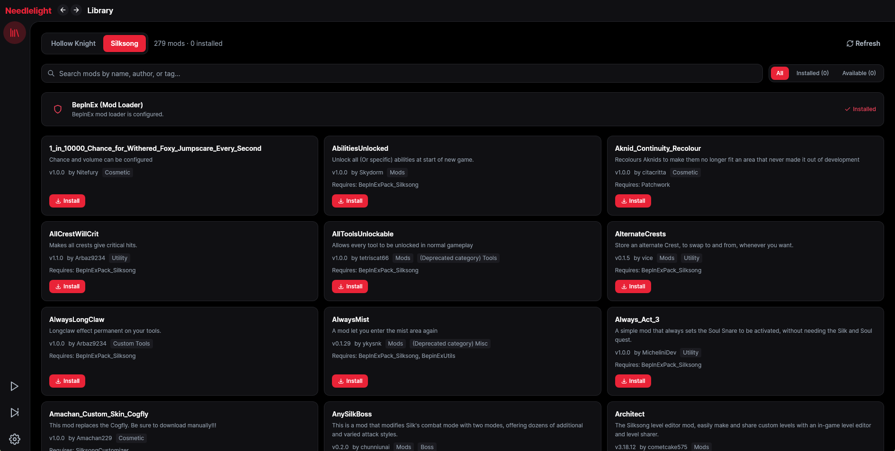

<h1 align="center"> Needlelight</h1>

<p align="center">
  Needlelight is a refreshed, production-ready evolution of the original Needlelight installer. It focuses on first-class support for Hollow Knight: Silksong, improved     stability when installing mods, and a cleaner, more maintainable codebase with better localization support.
</p>

<p align="center">
  
</p>

<div align="center">


[](https://Needlelight.vercel.app)
[](https://github.com/Aarav2709/Needlelight/releases)

</div>

Key improvements in Needlelight:

- Reworked game profile system: automatic detection and per-game executable resolution (better Silksong support).
- Safer installer flow with improved error handling around file access and mod installation.
- Small UX improvements: clearer messages, improved settings persistence, and fewer edge-case crashes.

## Usage

- Download the latest version from the releases page.
- Default game = Hollow Knight. To manage Silksong, open Settings → Game → select "Silksong". The active profile changes immediately and persists to your config.
- Search through and download the mods you like.
- Mods appear in the top left corner of the game title screen after installation.
- Enable/Disable mods using the toggle. (Manual update UI was removed in v6.0.0.0 — use the Releases page.)
- If you are unable to connect to the internet, LumaSong can be launched in offline mode where you can toggle mods/API.

## Features

- Multi‑game profiles: Switch between Hollow Knight and Hollow Knight: Silksong in Settings.
- Automatically downloads the [Modding API](https://github.com/hk-modding/api) which is required for mods to load. It also allows switching between modded and vanilla via the Toggle API button.
- Search through the 300+ mods available in the [official modlinks](https://github.com/hk-modding/modlinks).
- Group mods in modpacks and share them using the commands.
- Display mods that were recently updated or released.
- A single place to install, update, configure, view readmes, and report issues for mods.
- Manage mods not available through modlinks via the manual install button.

## Migration notes

- Older configs continue to load with Hollow Knight as the default (`game` missing or set to `hollow_knight`).
- When you choose Silksong in Settings, the config persists `silksong` and will restore that on next launch.

## Contributions

- If you want to suggest a feature or report a bug, report it on the issues page.
- If you want to contribute, feel free to. You can see what features are currently requested over here.
  If you want to contribute to localizations, please use Crowdin to add the translations.

## Credits

- Source code adapted from https://github.com/TheMulhima/Lumafly

- Programming

  - [56](https://github.com/fifty-six) - Creator of [Scarab](https://github.com/fifty-six/Scarab), on which Needlelight is based
  - [JacksonFaller](https://github.com/JacksonFaller), [Italy](https://github.com/jngo102), and [Acu1000](https://github.com/Acu1000)

- Translations

  - [Clazex](https://github.com/Clazex) - Chinese translations
  - [luiz_eldorado](https://github.com/luizeldorado) - Portuguese translations
  - [Dastan](https://github.com/Dastan21) - French translations
  - [Adrin](https://twitter.com/Adrin63_?t=lbzYGgt-3Zybjb_S2xqt2A&s=09) and [Helen](https://ko-fi.com/helensb) - Spanish translations
  - [Страг](https://discordapp.com/users/274945280775028736) - Russian translations
  - [Acu1000](https://github.com/Acu1000) - Polish translations
  - [Sawayoshi](https://twittter.com/sawayoshiyt) - Japanese translations
  - [Thommie](https://discordapp.com/users/454185487641608193) - Dutch translations

## Windows SmartScreen (free workaround)

Because the app isn’t code-signed with a paid certificate, Windows SmartScreen may warn on first launch. Free options:

- Unblock the downloaded ZIP before extracting.

  - Right‑click the ZIP → Properties → check “Unblock” → OK → then extract.
  - Or in PowerShell (replace the filename if different):

    ```powershell
    Unblock-File -Path .\Needlelight-Windows.zip
    Expand-Archive .\Needlelight-Windows.zip -DestinationPath .\Needlelight
    ```

- If already extracted, unblock the files:

  ```powershell
  Get-ChildItem .\Needlelight -Recurse | Unblock-File
  ```

- Verify downloads with the provided SHA256SUMS.txt in each release.

Note: Fully removing SmartScreen requires a trusted code‑signing certificate (paid). The steps above avoid the “downloaded from the internet” flag and keep things safe and free.

## 🔐 Verify downloads (SHA‑256)

Each release includes a `SHA256SUMS.txt` file. Verify the file(s) you downloaded match the published checksums.

- Download `SHA256SUMS.txt` from the same release as your file.
- Put it in the same folder as the file(s) you want to verify.

Windows (PowerShell)

```powershell
# Show the file's SHA-256 and compare with SHA256SUMS.txt
Get-FileHash -Algorithm SHA256 .\Needlelight-Windows.zip

# Optionally verify multiple files manually by comparing the printed hash
# with the corresponding line in SHA256SUMS.txt.
```

Windows (Command Prompt)

```bat
certutil -hashfile Needlelight-Windows.zip SHA256
```

macOS

```bash
# Quick: print a file's hash
shasum -a 256 Needlelight-MacOS.zip

# Check against the whole list (expects files next to SHA256SUMS.txt)
shasum -a 256 --check SHA256SUMS.txt
# Outputs: "filename: OK" or "FAILED"
```

Linux

```bash
# Quick: print a file's hash
sha256sum Needlelight-Linux.zip

# Check against the whole list (expects files next to SHA256SUMS.txt)
sha256sum -c SHA256SUMS.txt
# Outputs: "filename: OK" or "FAILED"
```

Tip: You can also verify individual executables (e.g., `Needlelight.exe`, `Needlelight.AU.exe`) using the same commands.

## Silksong support & BepInEx

- Switch the active game from the top bar or Settings → Game. Needlelight now remembers a managed folder per game; if the stored path does not match the selected profile, you’ll be asked to pick the correct Silksong install.
- For Silksong, Needlelight installs BepInEx automatically when you toggle “Install/Toggle API.” It installs into the Silksong game root (next to the executable), not the Hollow Knight folder.
- Steam default path: `steamapps/common/Hollow Knight Silksong`. Mods live in `Hollow Knight Silksong_Data/Managed/Mods` (and `Disabled`).
- If auto-detect fails, browse to the Silksong executable (or `.app` on macOS). On Linux, both native and Proton installs are supported; pick the folder that contains `Hollow Knight Silksong_Data/Managed`.

## Custom modlinks

- Settings → “Use Custom Modlinks”: toggle on and paste a ModLinks.xml URL (e.g., a community list or your own fork). Needlelight will fetch that list first; if it’s invalid, it will fall back to the official modlinks and show an error.
- To revert to the official catalog, toggle “Use Custom Modlinks” off (or use the corresponding URL command). The current selection is saved per profile and applied on next launch.
