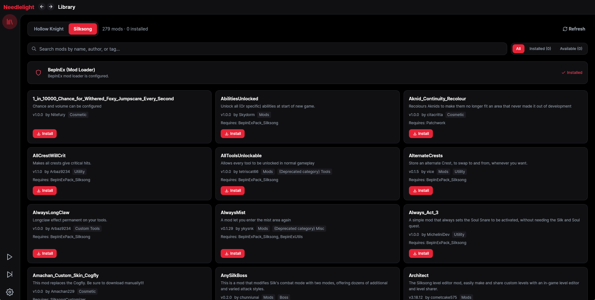

<h1 align="center"> Needlelight</h1>

<p align="center">
  Needlelight is a desktop mod manager built on Tauri + Rust with a modern frontend and a native backend.
</p>

<p align="center">
  
</p>

<div align="center">


[](https://github.com/Aarav2709/Needlelight/releases)

</div>

Key improvements in Needlelight:

- Ground-up rewrite of backend and frontend around a Rust-first architecture.
- Reworked game profile system with stronger Silksong path handling and mod catalog fallback.
- Installer flow with explicit checksums, extraction guards, and typed error paths.

## Project status and attribution

- This repository is **not associated with Lumafly**.
- The current codebase is a **fresh ground-up rewrite**.
- No legacy Lumafly implementation is used as runtime code in this project.
- Thanks to the original owners for inspiring me to make this.

## Credits

- **[Modrinth](https://modrinth.com/)** — The frontend UI of Needlelight is built on top of Modrinth's open-source [Theseus launcher](https://github.com/modrinth/code) (Vue.js frontend, `@modrinth/ui` component library, and `@modrinth/assets` icon set). Modrinth's code is licensed under the [GNU General Public License v3](https://github.com/modrinth/code/blob/main/COPYING.md). Huge thanks to the Modrinth team for making their work open source.
- **[hk-modding](https://github.com/hk-modding)** — Needlelight fetches mod data from the official [modlinks](https://github.com/hk-modding/modlinks) and installs the [Modding API](https://github.com/hk-modding/api).

## Usage

- Download the latest version from the releases page.
- Default game = Hollow Knight. To manage Silksong, open Settings → Game → select "Silksong". The active profile changes immediately and persists to your config.
- Search through and download the mods you like.
- Mods appear in the top left corner of the game title screen after installation.
- Enable/Disable mods using the toggle. (Manual update UI was removed in v6.0.0.0 — use the Releases page.)
- If you are unable to connect to the internet, Needlelight can still be launched in offline mode where you can toggle installed mods/API.

## Features

- Multi‑game profiles: Switch between Hollow Knight and Hollow Knight: Silksong in Settings.
- Automatically downloads the [Modding API](https://github.com/hk-modding/api) which is required for mods to load. It also allows switching between modded and vanilla via the Toggle API button.
- Search through the 300+ mods available in the [official modlinks](https://github.com/hk-modding/modlinks).
- Group mods in modpacks and share them using the commands.
- Display mods that were recently updated or released.
- A single place to install, update, configure, view readmes, and report issues for mods.
- Manage mods not available through modlinks via the manual install button.

## Migration notes

- Older configs continue to load with Hollow Knight as the default (`game` missing or set to `hollow_knight`).
- When you choose Silksong in Settings, the config persists `silksong` and will restore that on next launch.

## Contributions

- If you want to suggest a feature or report a bug, report it on the issues page.
- If you want to contribute, feel free to. You can see what features are currently requested over here.

## Windows SmartScreen (free workaround)

Because the app isn’t code-signed with a paid certificate, Windows SmartScreen may warn on first launch. Free options:

- Unblock the downloaded ZIP before extracting.
  - Right‑click the ZIP → Properties → check “Unblock” → OK → then extract.
  - Or in PowerShell (replace the filename if different):

    ```powershell
    Unblock-File -Path .\Needlelight-Windows.zip
    Expand-Archive .\Needlelight-Windows.zip -DestinationPath .\Needlelight
    ```

- If already extracted, unblock the files:

  ```powershell
  Get-ChildItem .\Needlelight -Recurse | Unblock-File
  ```

- Verify downloads with the provided SHA256SUMS.txt in each release.

Note: Fully removing SmartScreen requires a trusted code‑signing certificate (paid). The steps above avoid the “downloaded from the internet” flag and keep things safe and free.

## Verify downloads (SHA‑256)

Each release includes a `SHA256SUMS.txt` file. Verify the file(s) you downloaded match the published checksums.

- Download `SHA256SUMS.txt` from the same release as your file.
- Put it in the same folder as the file(s) you want to verify.

Windows (PowerShell)

```powershell
# Show the file's SHA-256 and compare with SHA256SUMS.txt
Get-FileHash -Algorithm SHA256 .\Needlelight-Windows.zip

# Optionally verify multiple files manually by comparing the printed hash
# with the corresponding line in SHA256SUMS.txt.
```

Windows (Command Prompt)

```bat
certutil -hashfile Needlelight-Windows.zip SHA256
```

macOS

```bash
# Quick: print a file's hash
shasum -a 256 Needlelight-MacOS.zip

# Check against the whole list (expects files next to SHA256SUMS.txt)
shasum -a 256 --check SHA256SUMS.txt
# Outputs: "filename: OK" or "FAILED"
```

Linux

```bash
# Quick: print a file's hash
sha256sum Needlelight-Linux.zip

# Check against the whole list (expects files next to SHA256SUMS.txt)
sha256sum -c SHA256SUMS.txt
# Outputs: "filename: OK" or "FAILED"
```

Tip: You can also verify individual executables (e.g., `Needlelight.exe`, `Needlelight.AU.exe`) using the same commands.

## Silksong support & BepInEx

- Switch the active game from the top bar or Settings → Game. Needlelight now remembers a managed folder per game; if the stored path does not match the selected profile, you’ll be asked to pick the correct Silksong install.
- For Silksong, Needlelight installs BepInEx automatically when you toggle “Install/Toggle API.” It installs into the Silksong game root (next to the executable), not the Hollow Knight folder.
- Steam default path: `steamapps/common/Hollow Knight Silksong`. Mods live in `Hollow Knight Silksong_Data/Managed/Mods` (and `Disabled`).
- If auto-detect fails, browse to the Silksong executable (or `.app` on macOS). On Linux, both native and Proton installs are supported; pick the folder that contains `Hollow Knight Silksong_Data/Managed`.

## Custom modlinks

- Settings → “Use Custom Modlinks”: toggle on and paste a ModLinks.xml URL (e.g., a community list or your own fork). Needlelight will fetch that list first; if it’s invalid, it will fall back to the official modlinks and show an error.
- To revert to the official catalog, toggle “Use Custom Modlinks” off (or use the corresponding URL command). The current selection is saved per profile and applied on next launch.

## Backend endpoint override (desktop)

- You can point Needlelight to your own backend catalog feeds at runtime (no frontend change required) using comma-separated URL env vars:
  - `NEEDLELIGHT_HK_MODLINKS_URLS`
  - `NEEDLELIGHT_HK_APILINKS_URLS`
  - `NEEDLELIGHT_SS_MODLINKS_URLS`
  - `NEEDLELIGHT_SS_APILINKS_URLS`
- Example:

  ```bash
  NEEDLELIGHT_HK_MODLINKS_URLS="https://your.backend/ModLinks.xml" \
  NEEDLELIGHT_HK_APILINKS_URLS="https://your.backend/ApiLinks.xml" \
  pnpm dev:desktop
  ```
