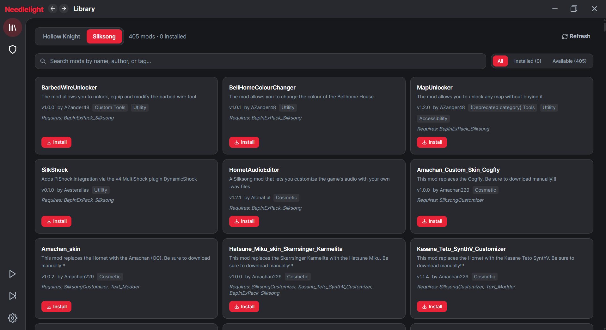

<h1 align="center">Needlelight</h1>

<p align="center">
A modern desktop mod manager for Hollow Knight and Hollow Knight: Silksong, built with Tauri and Rust.
</p>

<p align="center">

</p>

<div align="center">


[](https://github.com/Aarav2709/Needlelight/releases)

</div>

## About
- Needlelight is a desktop mod manager for Hollow Knight and Hollow Knight: Silksong.
- The project has been rebuilt from the ground up around a Tauri and Rust architecture, with a native Rust backend handling game files, mod installation, profiles, and other system level operations.
- The goal is to provide a simple way to discover, install, manage, and configure mods without having to manually deal with game files.

## Project Status and Attribution

- Needlelight is not associated with Lumafly.
- The current codebase is a fresh rewrite built around Tauri and Rust. It does not use the legacy Lumafly implementation as runtime code.
- The project was inspired by the work that came before it.

## Credits
### Modrinth
- The Needlelight frontend is built using parts of Modrinth's open source Theseus launcher project.
- This includes the Vue.js frontend, `@modrinth/ui` component library, and `@modrinth/assets` icon set.
- Modrinth's code is licensed under the GNU General Public License v3.
- Huge thanks to the Modrinth team for making their work available as open source.
- I personally e-mailed the team as well, for permission, they allowed me to do so.
> I have used the base, and iterated it accordingly, so it doesn't comes off as a rip-off of modrinth. Several features were stripped off, which were not required for my project.

### hk-modding
- Big thanks for hk-modding team, Needlelight uses the official mod data provided by [modlinks](https://github.com/hk-modding/modlinks) and installs the [Modding API](https://github.com/hk-modding/api) when required.

## Usage
- Download the latest version from the [Releases](https://github.com/Aarav2709/Needlelight/releases) page and launch Needlelight.
- Hollow Knight is selected by default.
- To manage Silksong, open Settings and select Silksong under Game. Needlelight keeps the selected game profile between launches.
- Once a game is configured, you can browse the available mods, install the ones you want, and manage your installed mods directly from Needlelight.
- Installed mods can be enabled or disabled from the application.
- Needlelight can also be used offline to manage mods that are already installed.

## Features
### Game Profiles
- Needlelight supports both Hollow Knight and Hollow Knight: Silksong.
- Each game has its own profile and game directory, so switching between games does not require manually changing paths every time.

### Mod Management
- Browse available mods through the official modlinks catalog.
- Install and manage mods directly from Needlelight without manually moving files around.
- You can also manually install mods that are not available through the catalog.

### Modding API
- Needlelight can install and manage the required Modding API for supported games.
- The API can also be toggled to switch between a modded and vanilla setup.
- For Silksong, Needlelight handles the BepInEx installation required for mod support.

## Silksong Support
- Needlelight supports Hollow Knight: Silksong as a separate game profile.
- When Silksong is selected, Needlelight uses the configured Silksong installation directory instead of the Hollow Knight directory.
- If a Silksong installation has not been configured yet, Needlelight will ask you to select the game folder.
- Needlelight also handles the BepInEx setup required for Silksong when the Modding API is installed.

## Custom Modlinks
- Needlelight supports custom ModLinks catalogs.
- Open Settings and enable `Use Custom Modlinks`, then provide the URL of a ModLinks.xml file.
- This can be useful for community maintained catalogs or personal forks of the official modlinks repository.
- Custom catalogs are saved separately for each game profile.
- To return to the official catalog, disable `Use Custom Modlinks` in Settings.

## Installation Diagnostics
- Needlelight records installation related information in its log file.
- If a mod installation fails or a mod appears to install correctly but does not load, the installation log can be useful when reporting the issue.

The log can be found at:
### Windows
```text
%APPDATA%\HKModInstaller\Needlelight-install.log
```

### macOS
```text
~/Library/Application Support/HKModInstaller/Needlelight-install.log
```

### Linux
```text
~/.config/HKModInstaller/Needlelight-install.log
```
If you have set `XDG_CONFIG_HOME`, the log will instead be located under:
```text
$XDG_CONFIG_HOME/HKModInstaller/Needlelight-install.log
```

## Backend Configuration
- The desktop application supports overriding the backend catalog endpoints through environment variables.
- These settings are primarily useful for development and testing different catalog sources.

The available variables are:
```text
NEEDLELIGHT_HK_MODLINKS_URLS
NEEDLELIGHT_HK_APILINKS_URLS
NEEDLELIGHT_SS_MODLINKS_URLS
NEEDLELIGHT_SS_APILINKS_URLS
```

Multiple URLs can be provided as a comma separated list.
For example:
```bash
NEEDLELIGHT_HK_MODLINKS_URLS="https://your.backend/ModLinks.xml"
NEEDLELIGHT_HK_APILINKS_URLS="https://your.backend/ApiLinks.xml"
```

## Development
- Needlelight is built using Tauri, Rust, and Vue.
- Install the project dependencies and use the project's development commands to start the desktop application.
- The Rust backend is located in the Tauri application and handles native functionality such as filesystem access, game detection, mod installation, and configuration.
> Though there is no estimation on when I will be done with v8.0.0.0, due to other projects and school life, I plan to finish it super soon, and if everything goes as planned, v8.0.0.0 will be the last Major Update to the launcher, and bugs (if any reported) will be fixed too!
> If there are any suggestions, which y'all wanna suggest, then go ahead. If multiple people think the launcher needs it, then I will surely add it, maybe as a minor update if I am constantly updating the launcher, or as a major update if I am not updating it, with additional bug fixes.

## Contributing
- Contributions are welcome.
- If you find a bug, have an idea, or want to suggest an improvement, open an issue on GitHub.
- If you want to contribute code, feel free to open a pull request.
